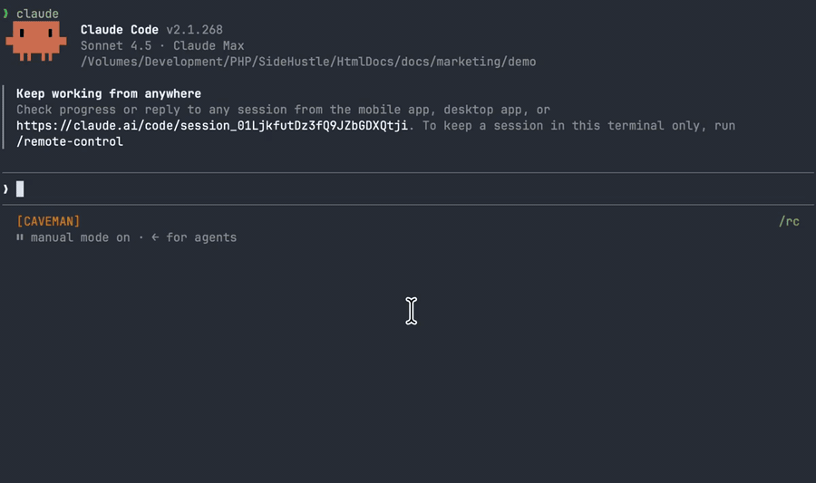

# htmldoc.space

Share one HTML or Markdown file as an unlisted link that lives 30 days. Ask your AI agent, or run one command. No deploy, no repo, no drag-and-drop.

## Ask your agent

Install the skill once, then say "share this report" in Claude Code, Codex, Pi, or [any agent that supports skills](https://www.skills.sh/agent). The agent runs the CLI and hands you the link. It never sees your key.

```sh
npx skills add ajaxray/htmldoc-skill
```

Then ask your agent in plain words: **"share this report"**, **"publish process.html with htmldoc"**, or **"make this plan shareable"**. It replies with the link and the expiry date.



Agents write better HTML than Markdown, and the Claude Code team [says so with twenty examples](https://claude.com/blog/using-claude-code-the-unreasonable-effectiveness-of-html). Their one caveat is sharing the file. This is that step.

No account yet? You do not need to set one up first. The first time you ask, the agent shows you one approval link. Sign in with GitHub there, check that the code matches, click Approve, and the share link comes back. The agent never sees your key.

## Or run one command

No install needed. stdout is only the URL, so it pipes. First time: `npx -y htmldoc-cli login` opens the same approval page, waits for your click, and stores the key.

```sh
npx -y htmldoc-cli report.html
# https://p.htmldoc.space/NO8JWj8cd57m
```


Both links above are real pages, shared with the tool while recording: [the agent's](https://p.htmldoc.space/SQBQdOCsiEhS) and [the CLI's](https://p.htmldoc.space/NO8JWj8cd57m). Open one.

## Examples

Real pages, each shared with the tool. They expire like any other page and get re-shared with `--update`, so the links stay the same.

- [A plan](https://p.htmldoc.space/qJydAHL14E67): Markdown, rendered. The product roadmap, published with the product.
- [A report](https://p.htmldoc.space/NO8JWj8cd57m): HTML with bars and a table. Source: [`demo/report.html`](demo/report.html).
- [A UI mockup](https://p.htmldoc.space/il9ISDzyOR59): HTML, static, generated from a one-paragraph brief. Source: [`demo/mockup.html`](demo/mockup.html).

Three more, straight from the Claude Code team's [html-effectiveness](https://github.com/anthropics/html-effectiveness) examples (MIT, Anthropic PBC), re-shared unchanged. Copies with their license in [`demo/html-effectiveness/`](demo/html-effectiveness/).

- [An implementation plan](https://p.htmldoc.space/A95uizMhj3My): milestones, data-flow diagrams, mockups, risks.
- [Component variants](https://p.htmldoc.space/6jSIcJCQbWWj): every state of a UI component on one sheet.
- [SVG illustrations](https://p.htmldoc.space/1cM6cn9gKoJx): inline figures for a blog post.

## Links

- Site and dashboard: [htmldoc.space](https://htmldoc.space/?utm_source=github)
- Docs: [htmldoc.space/docs](https://htmldoc.space/docs?utm_source=github)
- CLI: [`htmldoc-cli` on npm](https://www.npmjs.com/package/htmldoc-cli), source [ajaxray/htmldoc-cli](https://github.com/ajaxray/htmldoc-cli)
- Agent skill: [ajaxray/htmldoc-skill](https://github.com/ajaxray/htmldoc-skill) on [skills.sh](https://skills.sh)

## This repo has no code

It is the public home of the product: the [roadmap](ROADMAP.md), the [changelog](CHANGELOG.md), demo assets, and the issue tracker. The service itself is closed source and runs on one small server, by one person.

## Where to report what

| You want to | Go to |
|---|---|
| Ask for a feature, vote on the roadmap, report the site being down or wrong | [Issues here](https://github.com/ajaxray/htmldoc.space/issues) |
| Report a bug in the `htmldoc` command | [htmldoc-cli issues](https://github.com/ajaxray/htmldoc-cli/issues) |
| Report the agent skill misbehaving | [htmldoc-skill issues](https://github.com/ajaxray/htmldoc-skill/issues) |
| Report a page that should not be online | The **Report** link in the badge on that page, or [htmldoc.space/report](https://htmldoc.space/report) |
| Anything private | [htmldoc.space/contact](https://htmldoc.space/contact) |

## Roadmap

Every planned item is an issue labelled [`roadmap`](https://github.com/ajaxray/htmldoc.space/issues?q=is%3Aissue+is%3Aopen+label%3Aroadmap+sort%3Areactions-%2B1-desc). React with 👍 on the ones you want; that list is sorted by votes and it is what gets built next. Nothing on it is promised.

## Facts worth knowing

One file per link. HTML is served byte for byte; Markdown is rendered server-side. Caps: 2 MB HTML, 512 KB Markdown, 100 live pages per account. Links expire after 30 days; re-sharing with `--update` keeps the URL and resets the clock, and a page pinned from the dashboard never expires. Every page carries a small badge with a Report link and nothing else. No analytics or ads on pages. GitHub sign-in, one API key per account, handed to the CLI by a browser approval so you never copy it. Free.
